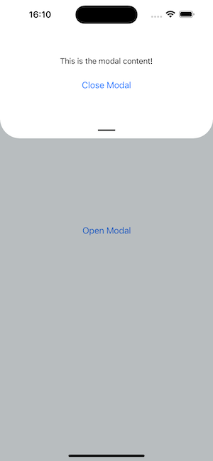

# react-native-top-sheet

An interactive top sheet with configurable options

## Installation

```sh
npm install react-native-safe-area-context
npm install react-native-top-sheet
```

## Showcase



## Usage

```js
import React, { useRef } from 'react';
import { View, Button, Text, StyleSheet } from 'react-native';
import { SafeAreaProvider } from 'react-native-safe-area-context';
import TopSheet, { type ModalHandle } from 'react-native-top-sheet';

const App = () => {
  const modalRef = useRef<ModalHandle>(null);

  const openModal = () => {
    modalRef.current?.show();
  };

  const closeModal = () => {
    modalRef.current?.hide();
  };

  const snapHeight = 0.3; // 30%
  // const snapHeight = 300; // 300px

  return (
    <SafeAreaProvider>
      <View style={styles.container}>
        <Button title="Open Modal" onPress={openModal} />
        <TopSheet ref={modalRef} snap={snapHeight}>
          <View style={styles.modalContent}>
            <Text style={styles.modalText}>This is the modal content!</Text>
            <Button title="Close Modal" onPress={closeModal} />
          </View>
        </TopSheet>
      </View>
    </SafeAreaProvider>
  );
};

const styles = StyleSheet.create({
  container: {
    flex: 1,
    justifyContent: 'center',
    alignItems: 'center',
    backgroundColor: '#f5fcff',
  },
  modalContent: {
    flex: 1,
    justifyContent: 'center',
    alignItems: 'center',
    padding: 20,
  },
  modalText: {
    fontSize: 16,
    marginBottom: 20,
  },
});

export default App;
```

## Contributing

See the [contributing guide](CONTRIBUTING.md) to learn how to contribute to the repository and the development workflow.

## License

MIT

---

Made with [create-react-native-library](https://github.com/callstack/react-native-builder-bob)
